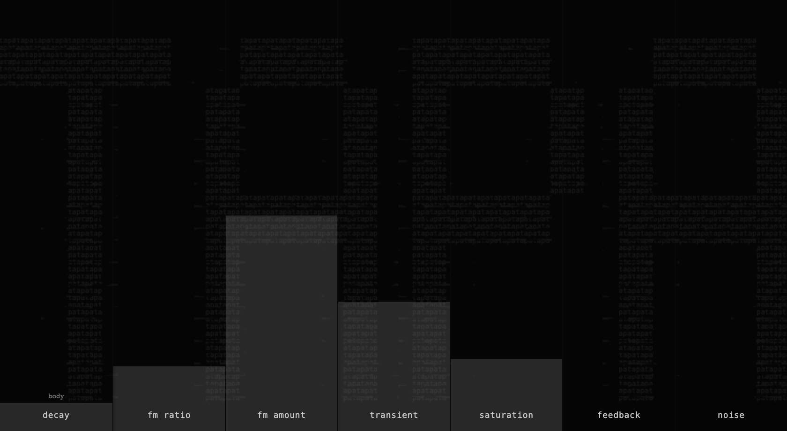

# Tapa

A monophonic drum synth: FM, noise and metallic resonances. Seven controls,
20 presets. Standalone, CLAP, AUv3 and WCLAP.



| Control | Effect |
|---|---|
| Decay | Tail length: 20–4000 ms at MIDI note 60. |
| FM Ratio | Modulator tuning, metallic pitch and noise colour. |
| FM Amount | FM depth and metallic spread. |
| Transient | Attack shape; clustered claps at mid settings with Noise near 100%. |
| Saturation | Harmonics and density. |
| Feedback | FM roughness and metallic ringing. |
| Noise | FM body → metal and wash → pure filtered noise. |

Envelope key tracking is inspired by the Roland Alpha Juno: higher notes decay
faster, lower notes ring longer. Cymbals track more gently.

**Body / linked** switches from short FM decay to following the main Decay.
Pitch and velocity follow MIDI; note-off lets the tail finish. Changes apply on
the next hit. Preset descriptions include suggested MIDI notes.

Drag vertically or across sliders. Double-click to reset.

## Build

Requires CMake 3.24+, C++17, chardsp, char-clap-utils, Compost, CLAP,
clap-helpers, clap-wrapper and CHOC. Set `*_ROOT` cache paths to your checkouts.
WCLAP needs a WASI SDK with pthread support.

```sh
cmake --preset native
cmake --build --preset native
ctest --preset native

WASI_SDK_ROOT=/path/to/wasi-sdk cmake --preset wclap
cmake --build --preset wclap
```

Use the `xcode` preset for macOS AUv3. Outputs: `build-*/artifacts/`.
